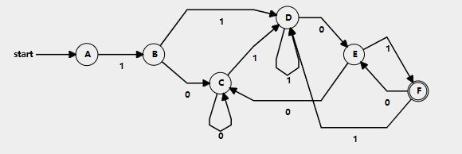
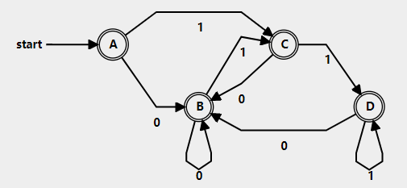

# 编译原理第4次作业

3.1 构造正规式相应的DFA

(1) $1(0|1)^*101$

(3) $((0|1)^*|(11))^*$

3.5 给出文法对应的正规式
$$
S\rightarrow aA \\
A\rightarrow bA|aB|b \\
B\rightarrow aA
$$

$$
Solve:\\
替换得到A\rightarrow bA|aaA|b \\
A\rightarrow (b|aa)^*b \\
S\rightarrow a(b|aa)^*b
$$

3.9 证明正规式$(a|b)^*$与$(a^*|b^*)^*$是等价的
$$
Proof:\\
L(LHS)=L((a|b)^*)=L(a|b)^*=(L(a)|L(b))^*=\{a|b\}^*=\{\epsilon,a,b,ab,\cdots\} \\
L(RHS)=L((a^*|b^*)^*)=L(a^*|b^*)^*=(L(a^*)|L(b^*))^*=(L(a)^*|L(b)^*)^*\\
=(\{a\}^*|\{b\}^*)^*=\{\epsilon,a,b,ab,\cdots\}\\
则L(LHS)=L(RHS)，故两者等价
$$
