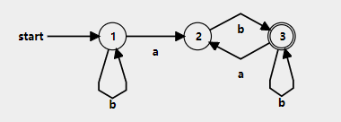

# 编译原理第5次作业

3.11

设字母表$\Sigma=\{a,b\}$，给出$\Sigma$上的正规式$$R=b^*ab(b|ab)^*$$

1）构造状态最小化$DFA M$，使得$L(M)=L(R)$

2）构造右线性文法$G$，使得$L(G)=L(M)$

$$
2)A\rightarrow aB|bA \\
B\rightarrow bC|b \\
C\rightarrow aB
$$
